# **Books**

PDF total size：**144MB**

## **Contents**

[English Book](#English-Book)

[Chinese Book](#Chinese-Book)

## English-Book

### [Pragmatic Scala(EMPTY)](Pragmatic-Scala.pdf)

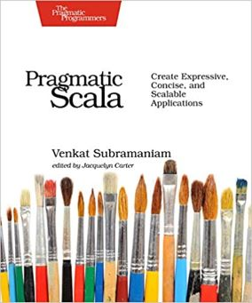

### [Beginning Scala](Beginning-Scala.pdf)

### [Learning Scala](Learning-Scala.pdf)

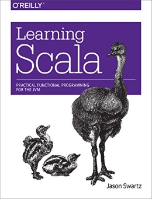

### [Functional Programming in Scala](Functional-Programming-in-Scala.pdf)

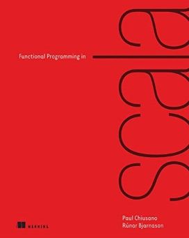

### [Play for Scala](Play-for-Scala.pdf)

### [Programming in Scala-Third Edition](Programming-in-Scala-Third-Edition.pdf)

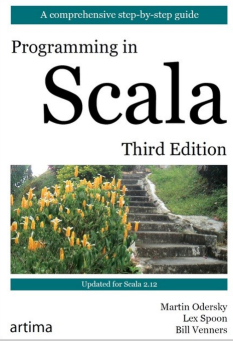

### [Programming in Scala-Fourth Edition](Programming-in-Scala-Fourth-Edition.pdf)

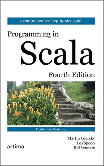

### [Programming in Scala-Fifth Edition(EMPTY)](Programming-in-Scala-Fifth-Edition.pdf)

### [Programming Scala First Edition](Programming-Scala-First-Edition.pdf)

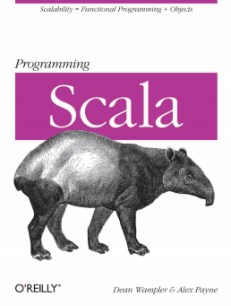

### [Programming Scala Second Edition](Programming-Scala-Second-Edition.pdf)

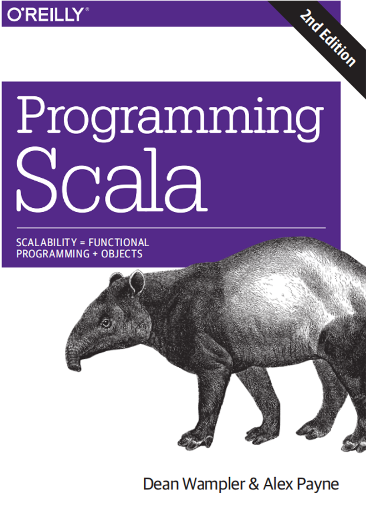

### [Programming Scala-Third-Edition(EMPTY)](Programming-Scala-Third-Edition.pdf)

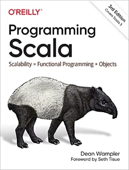

### [Scala with cats](Scala-with-cats.pdf)

### [Hands on scala programming](Hands-on-scala-programming.pdf)

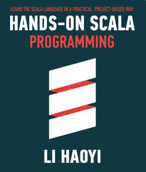

### [Scala for Data Science](Scala-for-Data-Science.pdf)

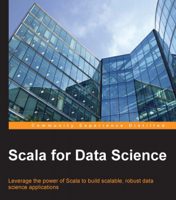

### [Scala for Machine Learning](Scala-for-Machine-Learning.pdf)

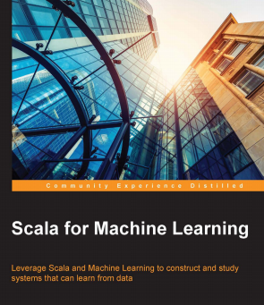

### [Scala High Performance Programming](Scala-High-Performance-Programming.pdf)

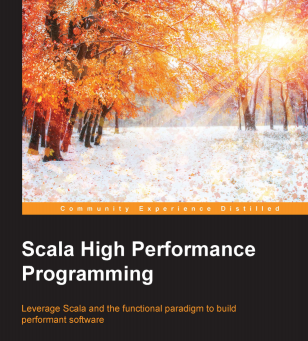

### [Scala in Action](Scala-in-Action.pdf)

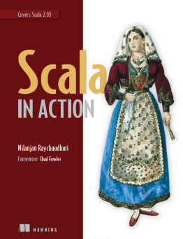

### [Scala By Example](Scala-By-Example.pdf)

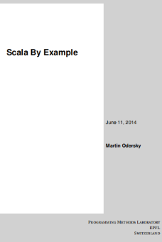

### [Scala Cookbook](Scala-Cookbook.pdf)

### [Scala for the Impatient](Scala-for-the-Impatient.pdf)

### [Scala in Depth](Scala-in-Depth.pdf)

### [Building Applications with Scala](Building-Applications-with-Scala.pdf)

### [Scala Design Patterns Second Edition](Scala-DesignPatterns-Second-Edition.pdf)

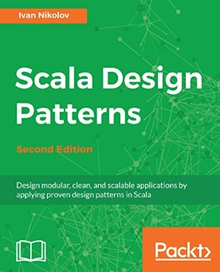

## Chinese-Book

由于中文版内容较大，为了方便下载，汇总传到了[百度云盘](https://pan.baidu.com/s/1N67CtkoYiHhdxQW5zO0VYQ)。提取码:zzqu，如果失效，提issues我会补充。

### [Scala编程(第3版)(暂无)]()

**暂无**

.jpg)

### [Scala编程(第4版)(暂无)]()

**暂无**

.jpg)

### [Scala函数式编程](Scala函数式编程.pdf)

### [Scala实用指南](Scala实用指南.pdf)

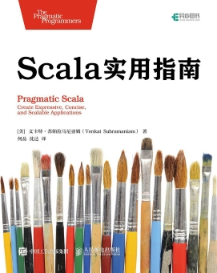

### [Scala学习手册](Scala学习手册.pdf)

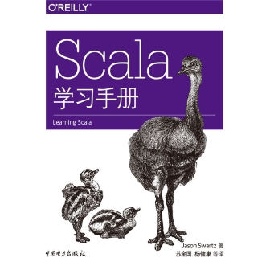

### [快学Scala(第2版)](快学Scala.pdf)

.jpg)

### [Scala程序设计(第2版)](Scala程序设计第2版.pdf)

.png)

### [高性能Scala](高性能Scala.pdf)

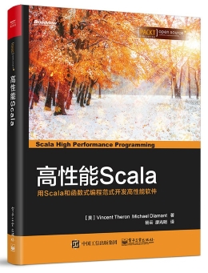

### [Scala并发编程第2版](Scala并发编程.pdf)

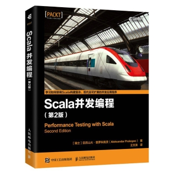

### [Scala编程思想](Scala编程思想.pdf)

### [Scala谜题](Scala谜题.pdf)

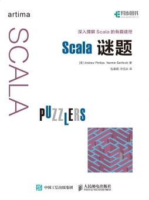

### [Scala集合技术手册](Scala集合技术手册.pdf)

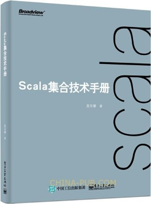